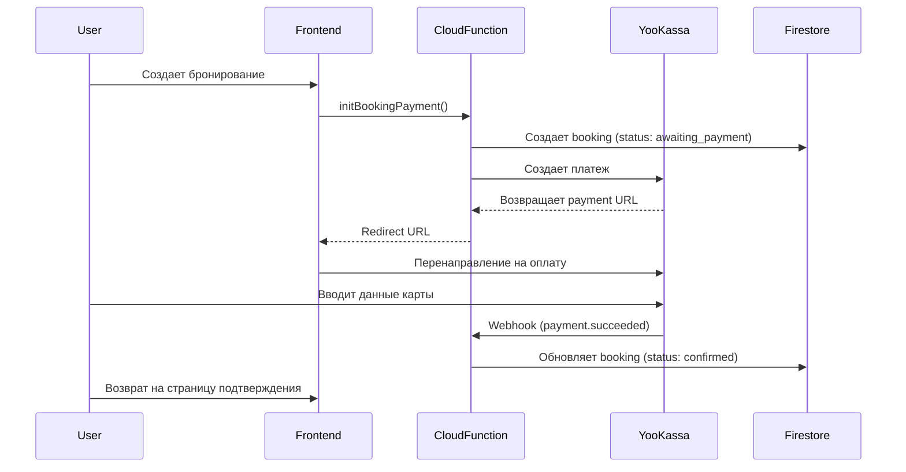

# Интеграция платежных систем

## Обзор

Система поддерживает интеграцию с двумя платежными провайдерами:
- **YooKassa** (ЮKassa) - полностью реализовано
- **Т-Банк** (Tinkoff) - базовая интеграция

## Архитектура

### Основные компоненты

1. **Cloud Functions** (`/functions/src/billing/`)
   - `initBookingPayment.ts` - инициализация платежа при бронировании
   - `yookassaWebhook.ts` - обработка webhook от YooKassa
   - `tbankWebhook.ts` - обработка webhook от Т-Банк
   - `testPaymentConnection.ts` - проверка подключения платежной системы

2. **Утилиты** (`/functions/src/utils/`)
   - `yookassa.ts` - класс для работы с API YooKassa
   - `tbank.ts` - класс для работы с API Т-Банк

3. **Frontend компоненты**
   - `/src/pages/admin/PaymentSettings.tsx` - настройки платежей для клубов
   - `/src/pages/public/BookingPaymentPage.tsx` - страница оплаты бронирования
   - `/src/pages/public/BookingConfirmationPage.tsx` - подтверждение после оплаты
   - `/src/components/BookingModal.tsx` - модальное окно бронирования

## YooKassa

### Конфигурация

Клуб настраивает YooKassa через админ-панель:
1. Вводит `Shop ID` и `Secret Key` из личного кабинета YooKassa
2. **Важно:** YooKassa не поддерживает тестовый режим через API. Система автоматически работает в боевом режиме
3. Настраивает webhook URL в личном кабинете YooKassa: `https://allcourt.ru/api/webhooks/yookassa`

**Примечание:** Для тестирования используйте реальные платежи на небольшие суммы (1-10 рублей) с последующим возвратом через личный кабинет YooKassa.

### Процесс оплаты



### Webhook обработка

URL: `https://allcourt.ru/api/webhooks/yookassa`

Обрабатываемые события:
- `payment.succeeded` - успешная оплата
- `payment.canceled` - отмена платежа
- `refund.succeeded` - успешный возврат

### Статусы бронирования

- `pending` - создано, ожидает действий
- `awaiting_payment` - ожидает оплату (блокирует слот на 10 минут)
- `confirmed` - оплачено и подтверждено
- `cancelled` - отменено

### Статусы платежа

- `pending` - платеж создан
- `awaiting_payment` - ожидает оплату
- `paid` - оплачен
- `cancelled` - отменен
- `refunded` - возвращен

## Т-Банк

### Конфигурация

Настройка аналогична YooKassa:
1. `Terminal Key` и `Secret Key`
2. Тестовый/боевой режим
3. Webhook URL настраивается автоматически

### Особенности

- Поддержка двухстадийной оплаты (холдирование)
- Возможность сохранения карт (RebillId)
- Поддержка QR-кодов для оплаты

## Автоматическая очистка

Cloud Function `cleanupExpiredBookings` запускается каждые 5 минут и:
1. Удаляет бронирования со статусом `awaiting_payment` старше 10 минут
2. Удаляет отмененные бронирования старше 15 минут

## Безопасность

1. **Хранение ключей**
   - Ключи шифруются перед сохранением в Firestore
   - Доступ только у администраторов клуба

2. **Проверка подписи**
   - Все webhook проверяют подпись запроса
   - В тестовом режиме проверка может быть отключена

3. **HTTPS**
   - Все запросы через защищенное соединение
   - Webhook endpoint только через HTTPS

## Тестирование

### YooKassa
**Важно:** YooKassa не поддерживает тестовые карты при использовании боевых ключей API.
- Используйте реальные карты для тестовых платежей на минимальные суммы (1-10 рублей)
- После тестирования делайте возврат через личный кабинет YooKassa
- Тестовые карты работают только в демо-среде YooKassa, которая недоступна через API

### Т-Банк тестовые карты
- Успешный платеж: `4300 0000 0000 0777`
- Недостаточно средств: `4300 0000 0000 0051`

## Firestore индексы

Необходимые композитные индексы:
```json
{
  "collectionGroup": "bookings",
  "fields": [
    {"fieldPath": "courtId", "order": "ASCENDING"},
    {"fieldPath": "paymentStatus", "order": "ASCENDING"},
    {"fieldPath": "date", "order": "ASCENDING"}
  ]
}
```

## Мониторинг

Логи доступны через Firebase Console:
```bash
firebase functions:log --only initBookingPayment,yookassaWebhook
```

## Известные проблемы и решения

1. **"Технический сбой" в YooKassa**
   - Причина: использование тестовых карт с боевыми ключами
   - Решение: использовать соответствующие ключи и карты

2. **Webhook не приходит**
   - Причина: не настроен URL в личном кабинете
   - Решение: настроить webhook URL в настройках YooKassa/Т-Банк

3. **"Missing or insufficient permissions"**
   - Причина: временная задержка обновления статуса
   - Решение: страница показывает "Обработка платежа" с кнопкой обновления

## Roadmap

- [ ] Сплиты платежей (разделение между платформой и клубом)
- [ ] Рекуррентные платежи для подписок
- [ ] Apple Pay / Google Pay
- [ ] СБП (Система быстрых платежей)
- [ ] Холдирование средств
- [ ] Массовые возвраты